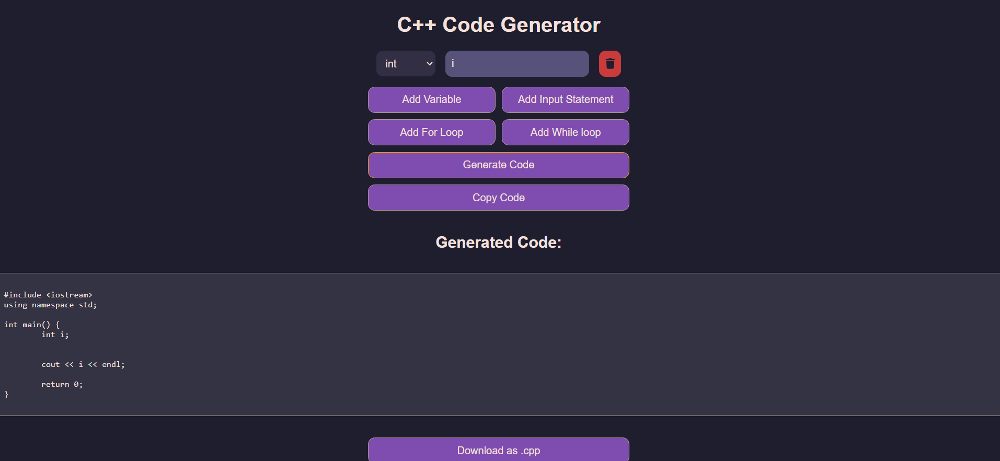
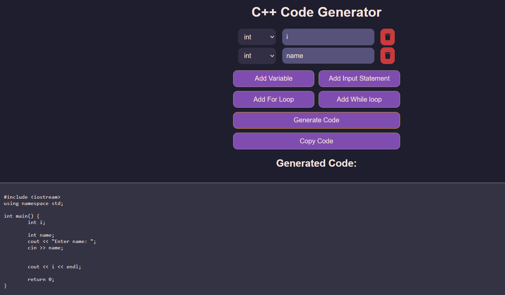

# C++ Code Generator

A simple JavaScript-based tool to generate repetitive C++ code for adding variables and input statements. Designed to save time by automating the creation of boilerplate code.

## Why I Created This

During my university labs, I found myself repeatedly writing the same C++ code for variable declarations and input statements. Instead of copying and pasting or relying on external tools like ChatGPT, I built this tool to automate the process and make it more efficient.

## Live Demo
https://abidzzz.github.io/cpp-cg

## Screenshots

## Features

- **Add Variables**: Easily declare variables of different types (`int`, `string`, `float`, `double`, `char`, `bool`, `void`).
- **Add Input Statements**: Automatically generate `cin` statements to capture user input.
- **Dynamic UI**: Add or remove variable and input fields dynamically.
- **Copy Code**: Copy the generated C++ code to your clipboard with one click.
- **Download as `.cpp`**: Download the generated code as a `.cpp` file for immediate use.
- **Clean and Responsive Design**: Built with a modern, dark theme for ease of use.

## How to Use

1. **Add Variables**:
   - Select the variable type from the dropdown.
   - Enter the variable name in the input field.
   - Click "Add Variable" to include it in the generated code.

2. **Add Input Statements**:
   - Click "Add Input Statement" to generate `cin` statements for the declared variables.

3. **Generate Code**:
   - Click "Generate Code" to see the C++ code in the output box.
   - Use the "Copy Code" button to copy the code to your clipboard.
   - Use the "Download as .cpp" button to save the code as a `.cpp` file.

## License

This project is licensed under the **GNU GENERAL PUBLIC LICENSE**.  

## Contributing

Contributions are welcome! If you have any suggestions or improvements, feel free to open an issue or submit a pull request.
